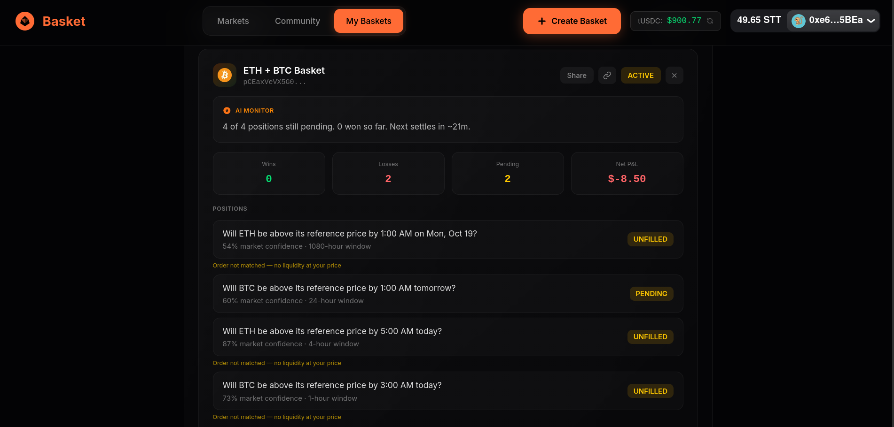
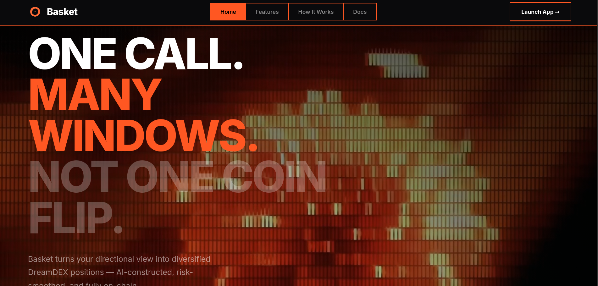
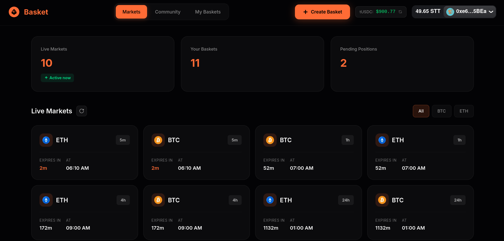

# Basket

**Spread a directional view across several smaller windows instead of one all-or-nothing bet, with an AI that shows its reasoning before anything trades.**

---

## The Problem

Most Event Contracts are binary: one window, one outcome, fully right or fully wrong. This is a real adoption barrier. A user with genuine conviction about BTC's near-term direction still faces uncomfortable variance — a single window expiring against them wipes out the entire position, even if their underlying thesis was correct and four other windows that day would have paid out.

This isn't just a UX inconvenience. The DreamDEX bounty explicitly calls out "accelerating Event Contracts adoption" as a goal. Single-window variance is one reason casual users hesitate to try prediction markets at all — the risk profile feels more like gambling than expressing a view.

---

## The Solution

Basket lets you turn one directional view into a structured position across several time windows:

1. **State your view.** Pick an asset (BTC, ETH, or both), number of windows, max spend, and risk tolerance.
2. **AI proposes a basket.** The constructor queries live on-chain markets, selects windows with different expiry times, and shows its reasoning — not a black box, but a transparent proposal with liquidity data, variance comparison, and worst/best case payouts.
3. **You approve (or don't).** Nothing trades until you sign. Every order is signed from your own wallet.
4. **Watch it resolve honestly.** The AI Monitor narrates your basket's state in plain language as legs settle — including losses, not just wins.
5. **Redeem in one flow.** When all legs settle, claim your winnings across all positions.

---

## Screenshots

### Landing Page
*Entry point with value proposition and quick-start flow*



### AI Basket Constructor
*Proposal screen showing reasoning, liquidity notes, variance comparison, and tamper-evident hash*



### Main App / Live Markets
*Dashboard with live markets sidebar, basket history, and real-time status*



---

## Key Features

- **AI Basket Constructor** — Queries live Trading-status markets, selects windows with timing diversity, returns structured reasoning. Hard caps on spend and basket size enforced in code, not just prompted.

- **Computed Risk Comparison** — Real variance math comparing your basket's standard deviation against a single all-in bet. The specific reduction percentage is calculated from actual position sizes and prices, not a vague claim.

- **Tamper-Evident Proposal Hash** — Every proposal includes a SHA-256 hash of its contents and timestamp, stored server-side before returning to the client. The proposal you approve is the proposal that executes.

- **AI Monitor** — Honest live narration through settlement. Shows wins, losses, and pending legs. Regenerates when status changes, not just on page load.

- **Dashboard** — Live markets sidebar with real-time countdowns, historical base rate stats (settlement rate, average spread), basket history with status tracking.

- **Community Sharing** — Name and describe your basket, share a public link, let others copy-to-edit with live refreshed prices. Ask-AI feature lets viewers query the reasoning behind a shared basket.

- **Non-Custodial by Design** — Every order signed by the user from their own wallet. No autonomous trading, no session keys, no custody beyond a standard DreamDEX order.

---

## Technical Credibility

### Correct Tick-Precision Quantization
The SDK's `createOrder` handles tick quantization internally, but price *discovery* from order books requires care. Naive float conversion misses the tick grid on almost every real probability — we refresh prices from live order books and add appropriate slippage to ensure fills.

### The Redeem Gotcha
Settled markets disappear from the default `loadMarkets()` response. The redeem flow queries `getMarketOnchain()` directly for each leg's marketId, checking for Resolved (status 4) or Voided (status 5) status before attempting redemption. See `app/api/basket/redeem/route.ts`.

### On-Chain Verification Before Every State Change
Firestore is a UI cache synced FROM on-chain reads — never the reverse. Every status update in `narrate/route.ts` calls `getMarketOnchain()` for each leg before updating the database. The client never writes basket/leg status directly.

### Server-Side AI Only
Gemini API calls happen exclusively in Next.js API routes (`/api/basket/construct`, `/api/basket/narrate`, `/api/basket/ask`). The API key lives in server environment variables only, never exposed to the client bundle.

### Unified Market Status Constants
A single shared constant (`MIN_TRADEABLE_BUFFER_SECONDS = 30`) governs time-to-expiry checks across construct, copy, and batch-order flows — no inconsistent hardcoded values. See `lib/market-constants.ts`.

### Bounded Carry-Forward for Unfilled Legs
When an order doesn't fill due to thin liquidity, the system offers a one-time carry-forward to the next window in the same series — but this requires explicit user approval and a fresh wallet signature. No autonomous resubmission, no standing permissions, exactly one offer per original leg. The carry-forward prompt only appears after the original window locks (on-chain status verified), and dismissing it marks the leg as handled permanently. See `app/api/basket/carry-forward/route.ts`.

---

## Honest Limitations

- **Basket-only.** No single-bet mode. This is a deliberate scope choice — the product thesis is specifically about risk-smoothing through multiple windows.

- **Small live market pool.** Testnet has roughly a dozen concurrent windows across BTC/ETH and available intervals (5min, 15min, 1hr). Requesting 5 windows sometimes returns 2-3 because that's what's actually Trading.

- **Cross-asset baskets spread exposure, not measured correlation.** When you build a BTC + ETH basket, you're spreading across two different assets. We do NOT claim any specific statistical correlation number — that would require historical data we haven't validated.

- **Testnet only.** v1 is built and tested on Somnia Shannon (chain ID 50312). No mainnet deployment.

- **Thin liquidity on some windows.** Short-interval markets can have sparse order books. The UI shows liquidity labels (deep/thin/stale) to set expectations, but fill prices may vary from quotes.

---

## What's Next

- **Non-custodial on-chain escrow** — A basket-aware contract that can hold and distribute payouts atomically, removing the current pattern of N separate redeems.

- **Deeper community trust signals** — Track record metrics for shared baskets (historical win rate, average return) based on real settled outcomes, not self-reported claims.

- **Rigorous correlation modeling** — Once enough historical settlement data exists, compute actual cross-window and cross-asset correlations to inform the AI constructor's selections.

---

## Tech Stack

- **Next.js** (App Router) — Frontend and API routes
- **@somnia-chain/markets-sdk** — DreamDEX Event Contracts interaction
- **viem** — Ethereum client
- **Firebase** — Firestore for state, Auth for user scoping
- **Gemini** — AI constructor and monitor (server-side only)

---

## Setup

### Prerequisites
- Node.js 18+
- A WalletConnect project ID
- Firebase project with Firestore enabled
- Gemini API key

### Install

```bash
git clone https://github.com/your-repo/basket.git
cd basket
npm install
```

### Configure

Copy `.env.example` to `.env.local` and fill in your values:

```bash
cp .env.example .env.local
```

Required variables:
- `NEXT_PUBLIC_FIREBASE_*` — Firebase project credentials
- `NEXT_PUBLIC_WALLETCONNECT_PROJECT_ID` — WalletConnect project ID
- `GEMINI_API_KEY` — Gemini API key (server-side only)

### Run

```bash
npm run dev
```

Open [http://localhost:3000](http://localhost:3000).

---

## Team

Solo builder: **DrApkFile** — Full stack software and blockchain engineer.

---

## License & Context

Built for the **Somnia x DreamDEX Event Contracts Hackathon**.

MIT License.
